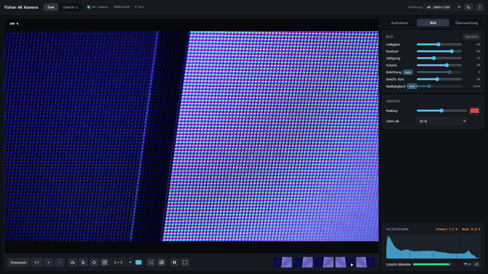

# Yizhan 4K Kamera

Windows-Programm für die USB-Kamera **Yizhan 4K 60MP**: Live-Bild in 4K, Fotos, Videos, Intervallfotos, Rückblick, Bewegungsüberwachung, Fokus-Peaking und eine Galerie mit Abspieler und Schnitt. Läuft als einzelne portable .exe, ohne Installation und ohne Treiber – die Kamera ist eine normale USB-Kamera (UVC).

Kein offizielles Programm des Herstellers. „Yizhan“ steht hier nur, damit klar ist, für welche Kamera das Programm gedacht ist. Andere USB-Kameras funktionieren meist auch; das Programm zeigt nur die Regler an, die eine Kamera wirklich anbietet.



## Download

Die neueste Fassung gibt es unter [Releases](https://github.com/3d-cnc/Yizhan-4K-Kamera/releases/latest): `Yizhan-4K-Kamera-V….exe` herunterladen und per Doppelklick starten. Läuft unter Windows 10 und 11 (64 Bit).

Die Datei ist nicht signiert. Beim ersten Start warnt deshalb vermutlich SmartScreen („Der Computer wurde durch Windows geschützt“). Dann „Weitere Informationen“ und „Trotzdem ausführen“ wählen.

## Erste Schritte

1. Kamera per USB anschließen. Windows erkennt sie als „4K Camera“.
2. Objektivdeckel abnehmen und die Blende am Objektiv öffnen – sonst bleibt das Bild schwarz.
3. Programm starten. Es nimmt die Kamera von selbst, mit der höchsten Auflösung und automatischer Belichtung und automatischem Weißabgleich.

Fotos und Videos landen in `Bilder\Yizhan 4K` (im Menü änderbar).

## Funktionen

- **Live-Bild:** bis 3840 × 2160, Auflösung wählbar, Zoom mit Mausrad und Verschieben per Ziehen, 1:1-Ansicht, Spiegeln waagrecht und senkrecht, Fadenkreuz, Raster (3 × 3 bis 16 × 16, Farbe wählbar), Standbild, Vollbild.
- **Fotos:** in voller Auflösung als JPG oder PNG, so gespiegelt wie die Ansicht; Intervallfotos (alle X Sekunden, N Bilder).
- **Videos:** MP4 (H.264) oder WebM (VP9), 10 bis 50 Mbit/s; die Datei wird laufend geschrieben, mit Anzeige des freien Platzes.
- **Rückblick:** Die letzten 30 bis 300 Sekunden laufen im Speicher mit. Ein Tastendruck (B) speichert sie als Video – auch das, was schon passiert ist.
- **Überwachung:** Bereich im Bild aufziehen, Empfindlichkeit einstellen. Bei Bewegung ein Foto, ein Video mit Vorlauf oder nur eine Meldung; Stillstand-Alarm, wenn sich lange nichts mehr bewegt, z. B. wenn ein 3D-Drucker oder eine Fräse stehen bleibt.
- **Scharfstellen und Belichten:** Fokus-Peaking (scharfe Kanten farbig), Zebra (fast weiße Stellen gestreift), Histogramm mit Anteil reines Schwarz und Weiß, Schärfewert der Bildmitte mit Bestwert.
- **Regler der Kamera:** Helligkeit, Kontrast, Sättigung, Schärfe, Belichtung und Weißabgleich (mit Automatik), Belichtungskorrektur; gemerkt je Kamera, „Standard“ stellt die Automatik wieder her.
- **Galerie:** alle Fotos und Videos mit Vorschaubildern, große Ansicht, Öffnen, Im Ordner zeigen, Kopieren, Löschen in den Papierkorb.
- **Abspieler:** Videos Bild für Bild vor und zurück, Zeitlupe (0,1× bis 2×), ein Bild als Foto speichern, Anfang und Ende setzen und den Ausschnitt als neue Datei speichern.
- **Menü** (oben links): Nach Updates suchen, Fenstergröße beim Start (Vorgabe 1920 × 1080, auch eigene Größe; gilt sofort und bleibt gespeichert), helles oder dunkles Design, Speicherordner, Tastenkürzel, Beenden.
- **Design:** dunkel als Vorgabe, hell per Knopf oben rechts (Mond/Sonne), im Menü oder mit Strg+Umschalt+L; die Wahl bleibt gespeichert.
- **Versionsprüfung:** Neben dem Namen stehen die Version und ein Symbol. Es ist grün, wenn das Programm aktuell ist, rot, wenn es ein Update gibt (ein Klick führt zum Download), und grau, wenn sich das nicht prüfen lässt, etwa ohne Internet. Gefragt wird beim Start (abschaltbar) nach dem neuesten GitHub-Release dieses Repositorys.

Tastenkürzel und Hinweise: [LIESMICH.txt](LIESMICH.txt). Stand, Vorschläge und offene Punkte: [OFFEN.md](OFFEN.md).

## Was die Kamera kann

Am 07.10.2026 ausgelesen und am Gerät gemessen:

- Auflösung bis 3840 × 2160 bei höchstens 30 Bildern pro Sekunde (auch 2560 × 1440, 1920 × 1080, 1280 × 720, 640 × 480). 60 Bilder pro Sekunde gibt es in keiner Auflösung. „60 MP“ ist eine hochgerechnete Angabe; der Sensor liefert 8,3 Megapixel.
- Regler über Windows: Helligkeit, Kontrast, Sättigung, Schärfe, Belichtung (Automatik oder Stufe −6 … +2), Belichtungskorrektur, Weißabgleich. Alle wirken messbar am Bild.
- Die Kamera startet mit festem Weißabgleich, der das Bild lila färbt. Das Programm schaltet deshalb von selbst auf Automatik.
- Bei wenig Licht und automatischer Belichtung sinkt die Bildrate (gemessen bis auf 7–9 Bilder pro Sekunde). Belichtung von Hand auf Stufe −3 bis 0: 27–30 Bilder pro Sekunde.
- Kein Mikrofon – Videos sind ohne Ton.

## Am Gerät geprüft

Der Selbsttest (siehe unten) läuft an der echten Kamera ohne Fehler durch: Live-Bild, Regler, Foto in voller Auflösung, Video, Intervallfotos, Peaking, Rückblick, Überwachung, Galerie, Abspieler mit Bildschritt, Einzelbild und Schnitt. Noch nicht ausprobiert: die Kamera im Betrieb abziehen und wieder anstecken und das Programm während einer laufenden Aufnahme schließen – beides ist eingebaut.

## Aufbau

| Pfad | Inhalt |
|---|---|
| `programm/main.js` | Electron-Hülle: Fenster in der eingestellten Größe (Vorgabe 1920 × 1080), Versionsprüfung, Dateien (Fotos, Videos stückweise), Galerie über das eigene Protokoll `medien://` (mit Range und CORS), Vorschaubilder von Windows, Nachfrage beim Schließen während einer Aufnahme, Selbsttest |
| `programm/preload.js` | Brücke zwischen Seite und Programm (`window.kam`) |
| `programm/app/index.html`, `stil.css` | Oberfläche |
| `programm/app/js/menue.js` | Menü, Hell/Dunkel, Version und Updates, Fenstergröße beim Start |
| `programm/app/js/kamera.js` | Kamera wählen und starten, Bildrate, Regler aus den Fähigkeiten der Kamera |
| `programm/app/js/ansicht.js` | Einpassen, Zoom, Spiegeln, Fadenkreuz, Raster, Standbild, Histogramm, Schärfewert |
| `programm/app/js/aufnahme.js` | Foto, Video (`MediaRecorder`), Intervallfotos |
| `programm/app/js/puffer.js` | Rückblick: `VideoEncoder` (H.264, Hardware) läuft mit, Speichern ohne neues Kodieren |
| `programm/app/js/wache.js` | Überwachung: Bewegung im Bereich, Foto, Video mit Vorlauf, Stillstand-Alarm |
| `programm/app/js/peaking.js` | Fokus-Peaking und Zebra als WebGL2-Shader |
| `programm/app/js/galerie.js`, `abspieler.js` | Galerie, Vorschau, Bild für Bild, Einzelbild, Schnitt |
| `programm/app/js/schreiber.js` | schreibt Ausgaben von mediabunny über das Hauptprogramm in Dateien |
| `programm/build/icon.png` | Programmsymbol |
| `bilder/` | Bild für dieses README |

MP4-Dateien setzt das Programm mit [mediabunny](https://mediabunny.dev) zusammen und schneidet sie damit (MPL-2.0).

## Bauen

```
cd programm
npm install --ignore-scripts
node node_modules/electron/install.js
npm run bauen
```

`npm run bauen` legt die .exe mit der Version im Namen in den obersten Ordner, z. B. `Yizhan-4K-Kamera-V1.2.0.exe`. Die .exe selbst ist nicht im Repository. Bricht das Bauen beim Programmsymbol mit Exit-Code 3221225477 ab, einfach noch einmal starten.

## Selbsttest

```
cd programm
npx electron . --pruefen=bild.png
npx electron . --demo --pruefen=bild.png
```

Der Selbsttest startet das Programm in einem durchsichtigen Fenster mit eigenem, leerem Benutzerordner. `--demo` nimmt statt der echten Kamera das Testbild von Chromium, das sich bewegt. Er prüft:
- Live-Bild, Regler und dass der Weißabgleich mit Automatik startet,
- Hell/Dunkel (Vorgabe dunkel, Knopf, Menü, Strg+Umschalt+L, gespeichert), Versionsvergleich, Versionsprüfung gegen GitHub und den Update-Hinweis, Fenstergröße 1600 × 900 (gilt sofort, gespeichert, zu kleine Werte abgelehnt) und zurück,
- dass die Live-Seite und jeder Reiter der Seitenleiste auf 1920 × 1080 ohne Scrollen passen,
- Foto in voller Auflösung, gespiegeltes Video (abspielbar), Intervallfotos, Standbild,
- Peaking und Zebra, Rückblick (füllen, speichern, abspielbar),
- Überwachung mit Foto; mit `--demo` auch Video mit Vorlauf,
- Galerie, Abspieler (Dauer, Bildrate, Bild vor und zurück, Einzelbild, Schnitt auf 2 Sekunden), Löschen,
- dass die Seite keine Fehler meldet.

Dabei speichert er Bilder der Ansichten und ein Protokoll `bild-log.txt`. Bei einem Fehler endet er mit Exit-Code 1. Er funktioniert auch mit der fertigen .exe.

## Lizenz

Noch keine Lizenz festgelegt. Den Code ansehen ist erlaubt, weiterverwenden bisher nicht. Die mitgelieferte Bibliothek mediabunny steht unter der MPL-2.0.
